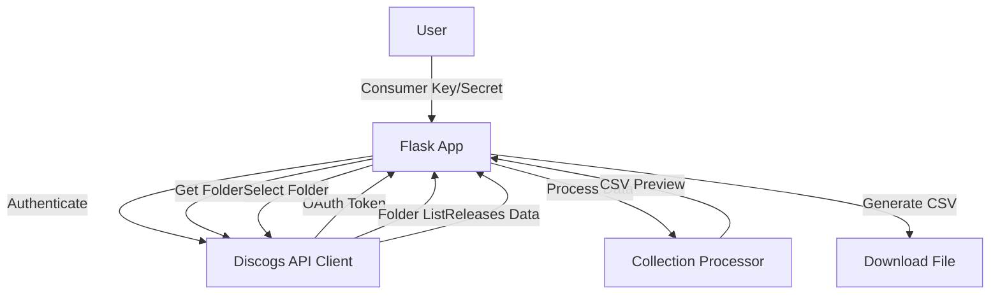

# Flask Web Application Plan for Discogs Collection to QR Factory CSV Generator

## Overview

Build a Flask web application that allows users to:

1. Authenticate with Discogs API using OAuth
2. Browse their collection folders
3. Select releases and generate a CSV file for QR Factory 3

## Architecture Diagram



## Detailed Plan

### 1. Project Structure

```
qrfactory_discogs/
├── app/                      # Flask application package
│   ├── __init__.py           # Flask app initialization
│   ├── routes.py             # Route handlers
│   ├── forms.py              # WTForms for form validation
│   ├── models.py             # Data models and processing logic
│   ├── templates/            # Jinja2 templates
│   │   ├── base.html         # Base template
│   │   ├── index.html        # Main page with auth form
│   │   ├── folders.html      # Folder selection page
│   │   ├── releases.html     # Release selection page
│   │   └── preview.html      # CSV preview page
│   └── static/               # Static files (CSS, JS)
│       ├── style.css         # Custom styles
│       └── script.js         # Client-side functionality
├── config.py                 # Configuration settings
├── requirements.txt          # Project dependencies
└── run.py                    # Application entry point
```

### 2. Implementation Steps

#### [ ] Step 1: Set up Flask application structure

- Create app directory with proper package structure
- Set up Flask app configuration (SECRET_KEY, session management)
- Configure Jinja2 templates and static files
- Add error handling middleware

#### [ ] Step 2: Implement authentication flow

- Create form for consumer key/secret input
- Integrate DiscogsCollectionClient authentication
- Store OAuth tokens in Flask session
- Handle OAuth callback (if needed)

#### [ ] Step 3: Build folder selection UI

- Display list of collection folders from Discogs API
- Allow user to select a folder
- Show loading states and error messages

#### [ ] Step 4: Implement release browsing and selection

- Fetch releases for selected folder
- Display releases in a sortable table (by date, artist, title)
- Add checkboxes for individual/multi-select
- "Select All" / "Deselect All" functionality
- Filter by date range option

#### [ ] Step 5: Create CSV preview and generation

- Process selected releases using DiscogsCollectionProcessor
- Display preview table of CSV data
- Allow editing of individual rows before final generation
- Generate downloadable CSV file with proper headers
- Show success message with download link

#### [ ] Step 6: Add user experience enhancements

- Progress indicators for API calls
- Responsive design for mobile/tablet
- Client-side validation
- Session management (remember selections)
- Error handling with user-friendly messages

### 3. Key Technical Decisions

**Authentication Flow:**

- Use Flask sessions to store OAuth tokens temporarily
- Don't persist tokens to database (simpler MVP approach)
- Validate credentials before proceeding to next steps

**Data Processing:**

- Process releases client-side for better performance
- Only send selected releases to server for CSV generation
- Cache API responses in session to avoid repeated calls

**CSV Generation:**

- Use existing DiscogsCollectionProcessor methods
- Generate preview as HTML table first
- Final CSV uses same template-based approach
- Add filename with timestamp for uniqueness

### 4. Security Considerations

- Use Flask-WTF for CSRF protection on forms
- Validate all user inputs (consumer keys, folder IDs)
- Sanitize outputs to prevent XSS
- Limit session lifetime for sensitive data
- Use HTTPS in production

### 5. Testing Strategy

- Unit tests for route handlers
- Integration tests for full workflow
- Test with various Discogs collection sizes
- Verify CSV format matches expected output
- Test error scenarios (invalid credentials, API failures)

### 6. Deployment Considerations

- Environment variables for configuration
- Gunicorn for production WSGI server
- Nginx as reverse proxy
- Docker containerization for easy deployment

## Next Steps

This plan provides a comprehensive roadmap for building the Flask application. The implementation will follow this structure, with each step building on the previous one to create a functional web interface for generating QR Factory CSV files from Discogs collections.
